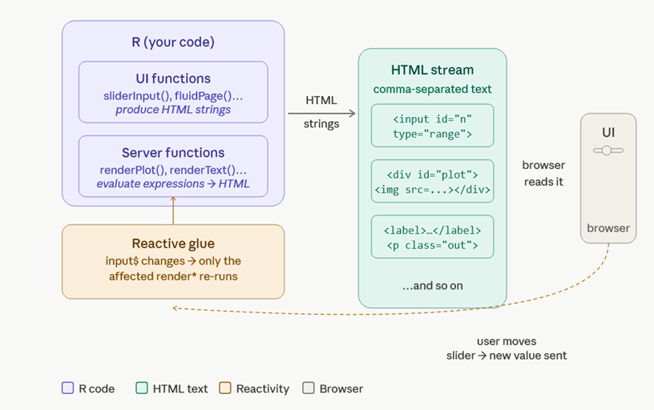

# Core idea:

R gives you a set of functions that write HTML for you. You never touch
HTML directly. You call R functions, and Shiny turns them into the
browser code.

There are really just three moving parts:

## 1. UI functions → HTML tags

When you write `textInput("name", "Your name")` in R, Shiny immediately
converts that into actual HTML text:\
`<label for="name">Your name</label>`\
`<input id="name" type="text" class="form-control">`

::: form-group
<label for="name">Your name</label>
<input id="name" type="text" class="form-control">
:::

The browser receives that comma-separated stream of HTML text and draws
a text box. `fluidPage()`, `sidebarLayout()`, `sliderInput()` - all of
these are just R functions that produce HTML strings.

## 2. Server functions → rendered outputs

On the server side, you write things like
`renderPlot({ hist(rnorm(100)) })`. Shiny runs that R expression,
captures what it produces (a plot image, a table, some text), converts
it to HTML, and sends it to the browser. `renderText`, `renderTable`,
`renderUI` - each one knows how to wrap its R output in the right HTML
tags.

## 3. Reactivity connects the two

When a user moves a slider, the browser sends the new value back to the
R server. Shiny's reactive system notices which render functions depend
on that input and re-runs only those, then pushes fresh HTML back to the
browser.

Here's a simple visual of the flow:

# Key insight

**HTML is just text**. A web page is nothing more than a very long
string of comma-separated tags that the browser reads top to bottom.
Shiny's only trick is that it writes that string for you using R
functions instead of making you type raw HTML.\
So when you call:
`rsliderInput("n", "Sample size", min=10, max=500, value=100)` Shiny
runs that function, which returns this character string:\
`<label class="control-label" for="n">Sample size</label>`\
`<input class="js-range-slider" id="n" min="10" max="500" value="100"/>`

That character string is rendered into this on the browser:

::: {.form-group .shiny-input-container}
<label class="control-label" for="n">Sample size</label>
<input class="js-range-slider" id="n" min="10" max="500" value="100"/>
:::

That string gets concatenated with all the other UI function outputs,
and the whole pile of text is sent to the browser, which parses it
left-to-right, comma-separated tag by tag, and draws the interface. The
server side works the same way. renderPlot() runs your ggplot code,
saves the image to a temp file, and injects `` into the
HTML. `renderText()` wraps your string in a ``. The browser never
knows it's talking to R - it just sees HTML.
