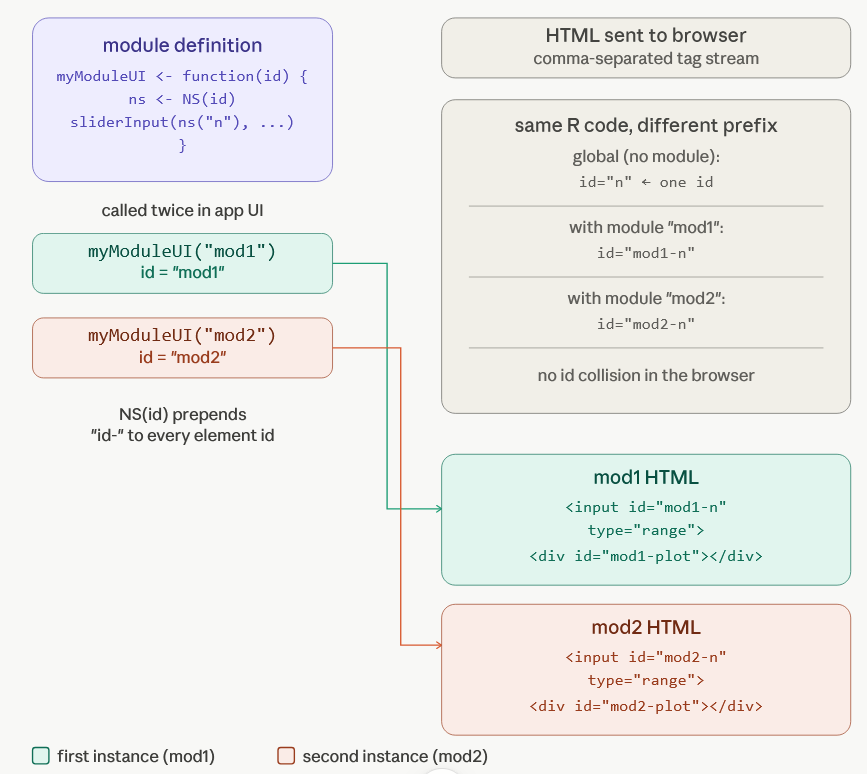

# Core idea:

R gives you a set of functions that write HTML for you. You never touch
HTML directly. You call R functions, and Shiny turns them into the
browser code.

There are really just three moving parts:

## 1. UI functions → HTML tags

When you write `textInput("name", "Your name")` in R, Shiny immediately
converts that into actual HTML text:\
`<label for="name">Your name</label>`\
`<input id="name" type="text" class="form-control">`

::: form-group
<label for="name">Your name</label>
<input id="name" type="text" class="form-control">
:::

The browser receives that comma-separated stream of HTML text and draws
a text box. `fluidPage()`, `sidebarLayout()`, `sliderInput()` - all of
these are just R functions that produce HTML strings.

## 2. Server functions → rendered outputs

On the server side, you write things like
`renderPlot({ hist(rnorm(100)) })`. Shiny runs that R expression,
captures what it produces (a plot image, a table, some text), converts
it to HTML, and sends it to the browser. `renderText`, `renderTable`,
`renderUI` - each one knows how to wrap its R output in the right HTML
tags.

## 3. Reactivity connects the two

When a user moves a slider, the browser sends the new value back to the
R server. Shiny's reactive system notices which render functions depend
on that input and re-runs only those, then pushes fresh HTML back to the
browser.

Here's a simple visual of the flow:

# Key insight

**HTML is just text**. A web page is nothing more than a very long
string of comma-separated tags that the browser reads top to bottom.
Shiny's only trick is that it writes that string for you using R
functions instead of making you type raw HTML.\
So when you call:
`rsliderInput("n", "Sample size", min=10, max=500, value=100)` Shiny
runs that function, which returns this character string:\
`<label class="control-label" for="n">Sample size</label>`\
`<input class="js-range-slider" id="n" min="10" max="500" value="100"/>`

That character string is rendered into this on the browser:

::: {.form-group .shiny-input-container}
<label class="control-label" for="n">Sample size</label>
<input class="js-range-slider" id="n" min="10" max="500" value="100"/>
:::

That string gets concatenated with all the other UI function outputs,
and the whole pile of text is sent to the browser, which parses it
left-to-right, comma-separated tag by tag, and draws the interface. The
server side works the same way. renderPlot() runs your ggplot code,
saves the image to a temp file, and injects `` into the
HTML. `renderText()` wraps your string in a ``. The browser never
knows it's talking to R - it just sees HTML.

# Shiny module

The key new idea with modules is namespacing. Without a module, every
input ID is global - `input$n`

is just `input$n`.

A module wraps a chunk of UI and server logic in its own private
namespace, so the same module can be used multiple times without ID
collisions. The mechanism is straightforward: you write two functions -
`myModuleUI(id)` and `myModuleServer(id)` - and Shiny handles the rest
by prefixing every HTML id attribute with the namespace you provide. The
R code is the same; what changes is the HTML it emits.

Here's a concrete before/after showing exactly what HTML gets produced:

**Without** a module - `sliderInput("n", ...)` emits:
`html<input id="n" type="range" ...>`

**With** a module called as `myModuleUI("mod1")` - that same
`sliderInput("n", ...)` inside the module UI now emits:
`html<input id="mod1-n" type="range" ...>` The `-` separator is the
entire trick.

Shiny prepends id `+ "-"` to every element ID inside the module. On the
server side, `moduleServer` does the same thing in reverse - when your
server function reads `input$n`, Shiny silently translates that to
`input$mod1-n` so it reads from the right namespaced element.

This lets you call `myModuleUI("mod1")` and `myModuleUI("mod2")` and get
two completely independent widgets in the HTML, even though they're
generated by identical R code.

!!!

The `NS(id)` call is really the whole story. `NS` stands for "namespace"
and it returns a small helper function. When you write `ns <- NS(id)`
and then `ns("n")`, it just returns the string `"mod1-n"`. That string
gets passed to `sliderInput()` as the `inputId`, and `sliderInput()`
places it in the HTML id attribute as normal.

Nothing magical - just string concatenation happening one layer up. On
the server side,
`moduleServer(id, function(input, output, session) { ... })` sets up a
filtered view of input that automatically reads from and writes to the
`mod1-` prefixed keys. So when your server code says `input\$n`, Shiny's
internals transparently read `input[["mod1-n"]]` from the real input
list. The result: you can stamp out as many instances of a module as you
like - `myModuleUI("ae")`, `myModuleUI("labs")`,
`myModuleUI("vitals")` - and each gets its own isolated bubble of HTML
ids, inputs, and outputs, all from the same R function definition.
